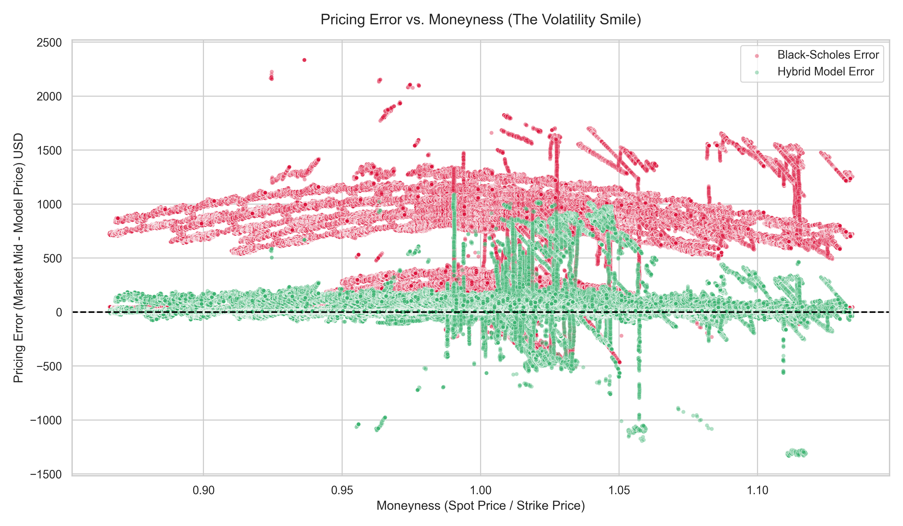
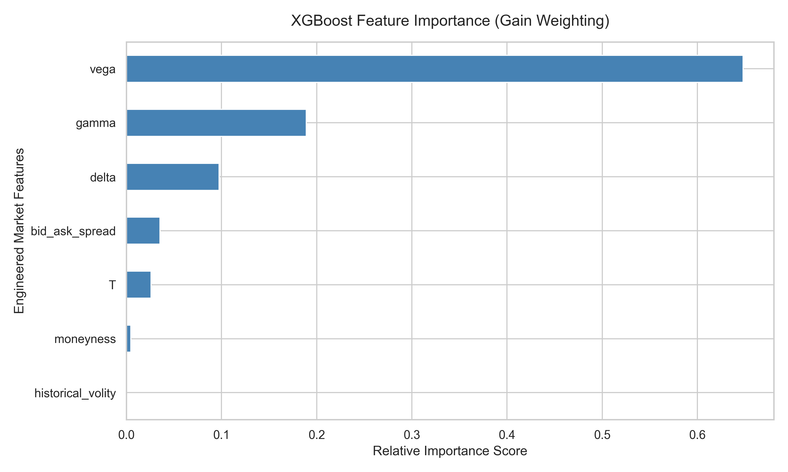

# Hybrid Option Pricing Engine

**Black-Scholes + XGBoost Residual Learning for Cryptocurrency Options**


A hybrid machine learning framework that combines the analytical foundation of the Black-Scholes model with XGBoost residual learning to improve option pricing accuracy in cryptocurrency markets. Rather than replacing Black-Scholes entirely, the model learns only its systematic pricing error, preserving financial interpretability while capturing real-world market effects.

---

## Motivation

Real cryptocurrency options violate nearly every Black-Scholes assumption:

| Assumption | Reality |
|---|---|
| Constant volatility | Volatility smiles and skews |
| Frictionless markets | Bid-ask spreads, liquidity premiums |
| Continuous trading | Market microstructure noise |
| Log-normal returns | Fat tails, jumps |
| No transaction costs | Exchange-specific pricing biases |

Rather than discarding Black-Scholes, this project treats it as a strong analytical prior and trains a machine learning model only on the unexplained residual. This results in better generalization, improved interpretability, lower model complexity, and financially meaningful predictions.

The figure below illustrates how the hybrid model corrects the Black-Scholes volatility smile, capturing the curvature that the analytical model systematically misses across different moneyness levels:



---

## Overview

Classical option pricing models assume constant volatility, frictionless markets, continuous trading, log-normal asset returns, and perfect liquidity. These assumptions rarely hold in cryptocurrency options markets, where pricing is shaped by volatility smiles, liquidity constraints, bid-ask spreads, and market microstructure effects.

This project introduces a two-stage pricing framework:

1. **Black-Scholes** produces an analytical price as a strong financial prior.
2. **XGBoost** learns the residual, the systematic gap between the analytical price and the observed market price.

The final hybrid price is:

$$P_{\text{Hybrid}} = P_{\text{Black-Scholes}} + f_\theta(X)$$

where $X$ represents engineered market features and $f_\theta(\cdot)$ is an XGBoost model trained on pricing residuals.

---

## Model Architecture

```
           Underlying Market Data
                     |
                     v
            Feature Engineering
                     |
       +-------------+-------------+
       |                           |
       v                           v
Black-Scholes Pricing       Market Features
       |                           |
       +------------+--------------+
                    |
                    v
           Residual Calculation
        (Market Price - BS Price)
                    |
                    v
             XGBoost Regressor
                    |
                    v
       Hybrid Price = BS Price + Predicted Residual
```

**Pipeline:**

```
Deribit Historical Data -> Market Data Cleaning -> Feature Engineering
-> Black-Scholes Pricing -> Residual Computation -> XGBoost Training
-> Hybrid Option Price
```

---

## Features

### Data Pipeline
- Historical Deribit options data via Tardis.dev
- Automated dataset construction and modular preprocessing
- Chronological train / validation / test split

### Market Microstructure Cleaning

Unreliable observations are filtered out at preprocessing:

- Missing or invalid quotes
- Negative bid-ask spreads
- Zero-volume contracts
- Expired contracts
- Unrealistic implied volatility values
- Duplicate observations

### Analytical Pricing Engine

A fully vectorized Black-Scholes implementation covering:

- European call and put pricing
- Delta, Gamma, Vega
- Time-to-maturity computation

### Feature Engineering

| Category | Features |
|---|---|
| Contract | Strike price, time to expiry, option type |
| Market | Underlying price, bid, ask, mid, spread, volume, open interest |
| Volatility | Historical volatility, implied volatility, rolling estimates |
| Black-Scholes | Analytical price, Delta, Gamma, Vega, moneyness |

The chart below shows which features the XGBoost model relies on most heavily when correcting Black-Scholes residuals:



### Residual Learning

The target variable is:

$$\text{Residual} = P_{\text{Market}} - P_{\text{Black-Scholes}}$$

Training on residuals rather than raw prices leads to faster convergence and more stable predictions, since the model only needs to explain the unexplained component of a financially grounded baseline.

---

## Technologies

| Category | Libraries |
|---|---|
| Data | Pandas, NumPy, Tardis.dev API |
| Analytical Pricing | SciPy, NumPy |
| Machine Learning | XGBoost, Scikit-learn |
| Visualization | Matplotlib |
| Testing | PyTest |

---

## Installation

**Clone the repository:**

```bash
git clone https://github.com/yourusername/hybrid-option-pricing.git
cd hybrid-option-pricing
```

**Create and activate a virtual environment:**

```bash
python -m venv .venv

# Linux / macOS
source .venv/bin/activate

# Windows
.venv\Scripts\activate
```

**Install dependencies:**

```bash
pip install -r requirements.txt
```

---

## Usage

Run the full pipeline with:

```bash
python main.py
```

This executes the following steps in sequence:

1. Download historical Deribit options data
2. Clean and validate market data
3. Engineer analytical and market features
4. Compute Black-Scholes prices and Greeks
5. Estimate historical volatility
6. Train the XGBoost residual model
7. Evaluate model performance
8. Save the trained model to `models/`
9. Generate diagnostic figures to `figures/`

---

## Testing

Run the unit test suite with:

```bash
pytest tests/
```

The test suite validates Black-Scholes call and put pricing, Greeks (Delta, Gamma, Vega), boundary conditions, and numerical stability.

---

## Results

Out-of-sample performance on Deribit BTC options:

| Model | RMSE (USD) | Error Reduction |
|---|---|---|
| Black-Scholes with Historical Volatility | 1,874.90 | baseline |
| Black-Scholes with Implied Volatility | 410.62 | 78.1% |
| **Hybrid (BS + XGBoost Residual)** | **139.19** | **92.6%** |

The hybrid model achieves a **92.58% structural error reduction** over the Black-Scholes historical volatility baseline, and a **66.1% improvement** even over the implied volatility baseline, which already incorporates forward-looking market information.

The scatter plot below compares hybrid model predictions against realized market prices. Points along the diagonal indicate accurate pricing:


---

## Future Work

- LightGBM and CatBoost residual learning
- Transformer-based option pricing
- Volatility surface modelling
- Local volatility and Heston stochastic volatility integration
- Hyperparameter optimization via Bayesian search
- Model explainability with SHAP values
- Real-time inference API

---

## License

This project is licensed under the MIT License. See the [LICENSE](LICENSE) file for details.

---

*Built on the foundational work of Fischer Black, Myron Scholes, and Robert Merton.*
